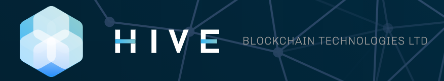

## Blockchain Case Study

# HIVE Blockchain Technologies Ltd.

## What Is It:
* HIVE Blockchain Technologies Ltd. operates as a cryptocurrency mining company in Canada, Sweden, and Iceland. It was incorporated in 1987 with headquarters in Vancouver, Canada. The company was formerly known as Leeta Gold Corp. and changed its name to HIVE Blockchain Technologies Ltd. in September 2017. The company is involved in the mining and sale of digital currencies, such as Ethereum, Ethereum Classic, and Bitcoin. 

* HIVE uses high powered computing assets to mine cryptocurrencies and validate transactions on blockchain networks for rewards paid in cryptocurrencies. The biggest costs incurred during mining of cryptocurrencies are electricity costs, hardware and fast internet. They owns state-of-the-art green energy-powered data centre facilities in Canada, Sweden and Iceland.  The reason for Hive to have the data centres in these countries is enjoy the low cost green/renewable energy and stable governments. Hive follows the below formula to operate business and generate profits:

** Gross Mining Profitability =f(
                                    (FACILITY HASH RATE,
                                    POWER CONSUMPTION)^1,
                                    (COIN PRICE,
                                    NETWORK HASH RATE)^2,
                                    (COST PER KWH,
                                    MAINTENANCE COSTS)^3 
                                ) **

## Why This Matters:
Hive is a publicly traded company because they give the shareholders the opportunity to access the profit margins from mining. The capital markets have very little options for an investor to participate in the blockchain sector and Hive provides the shareholders an amazing way to get exposure to the cryto world. They were the first blockchain company to list their stock on the Toronto Stock Exchange Venture (TSX-V) and it was a key component of their overall strategy. Some of their  main competitors include: Riot Blockchain Inc, Hut & Mining Corp and Marathon Patent Group Inc. All these companies including Hive incorporate almost $400 million USD in market capitalization.

## Why This May be Interesting:
* Hive ended their last fiscal year in March 2020 on a high note. Some of the highlights are listed below:
    * Their income from digital currency was $29.2 million USD
    * Gross mining margin of $8.2 million USD
    * Adjusted EBITDA of $7.2 million USD
    * Total current assets at 18.3 million USD
    * Hive funds 100% of their operations through sale of mined coins.
    * Last 52 week stock price ranged from $0.1350 - 3.500
    * Average Daily Value Traded stands at $804,000 USD
    * Hive has $110 million USD in market cap as of Sep 2020

## Resources
* [Hive Website](https://www.hiveblockchain.com/)
* [Yahoo Finance](https://finance.yahoo.com/quote/HIVE.V?p=HIVE.V)
* [HIVE Blockchain Announces Plans to Expand Ethereum Footprint by 30% Using 6 MW of Green Energy to Mine Ethereum](https://finance.yahoo.com/news/hive-blockchain-announces-plans-expand-060000639.html)
* [Hive Blockchain ramps up hardware inventory](https://coingeek.com/hive-blockchain-ramps-up-hardware-inventory/)

