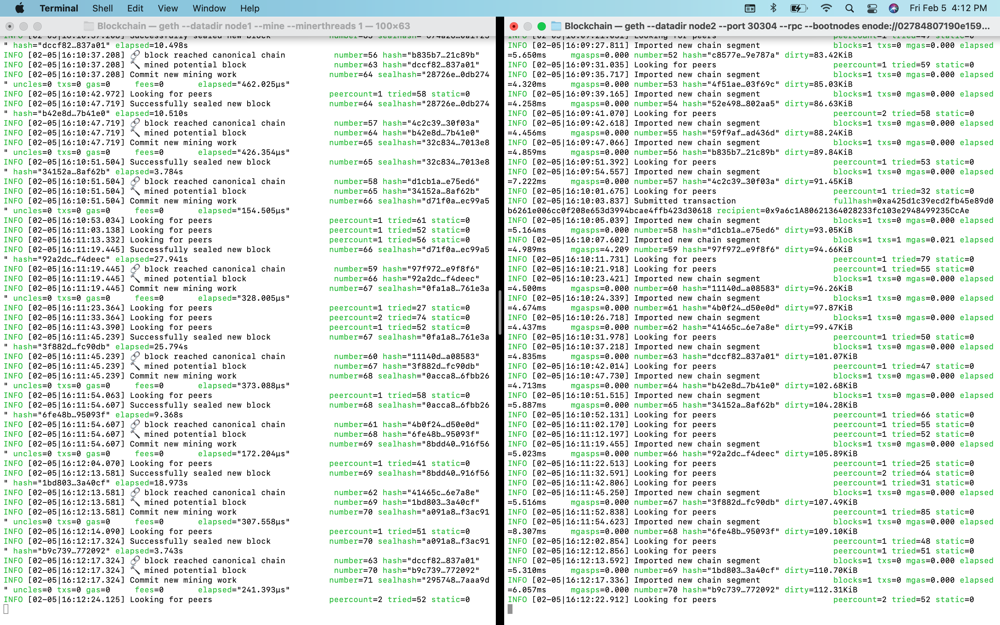
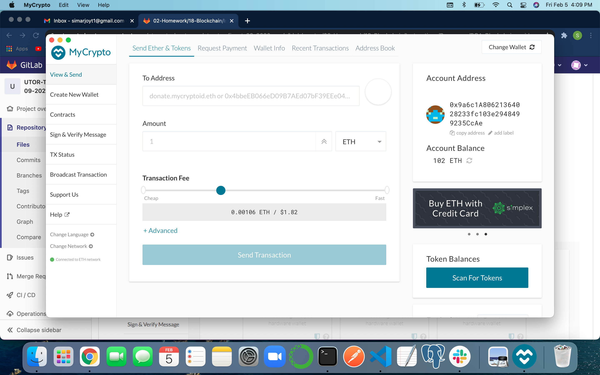
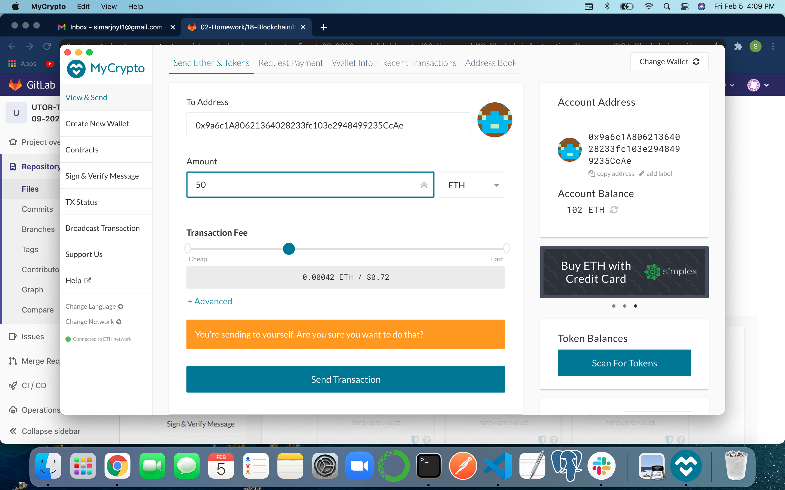
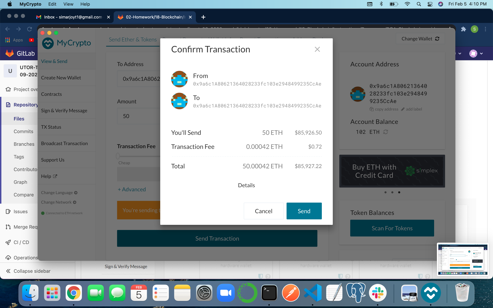
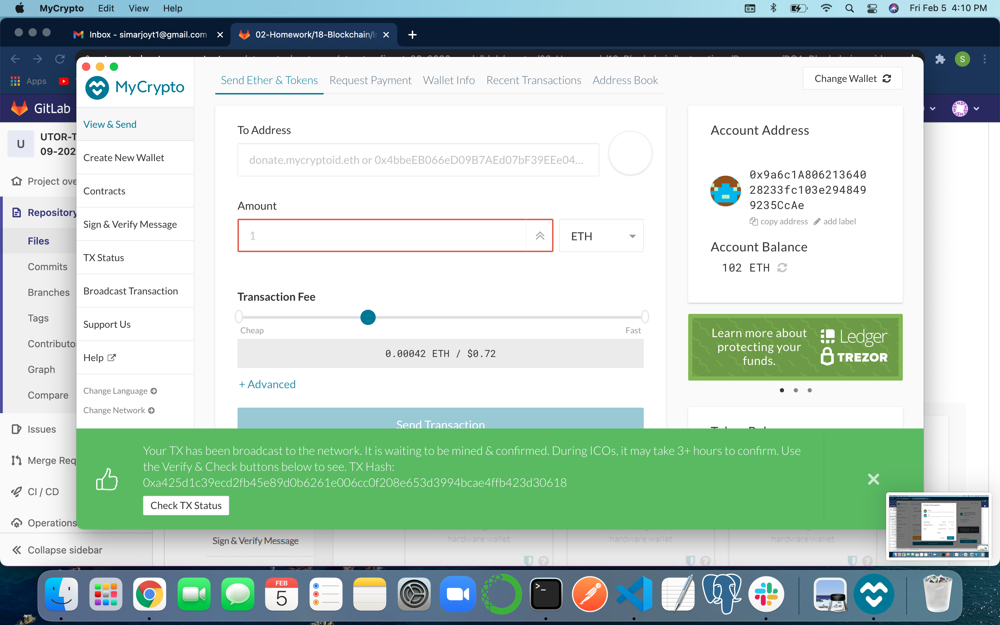
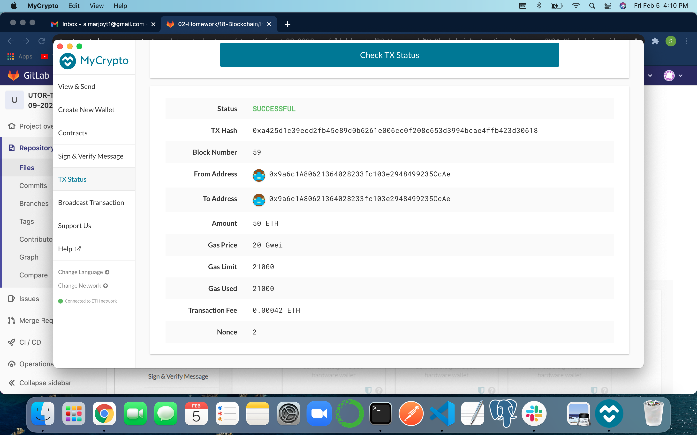

# Blockchain Instructions:

* Type **./geth --datadir node1 --mine --minerthreads 1**  in terminal to start node1

* Type **./geth --datadir node2 --port 30304 --rpc --bootnodes "enode://SEALER_ONE_ENODE_ADDRESS@127.0.0.1:30303"** in terminal to start node2

* See screenshot below showing the nodes running and producing new blocks.
    * 

* Open MyCrypto and connect to the custom network called **simarcoin** which is created using custom network information that was set in the genesis. 

* Open wallet through Keystore file and select the keystore from node1 folder. Enter the passcode which was set while initalizing the nodes.

* Check Balance and send transaction. Please refer to screenshots below:

